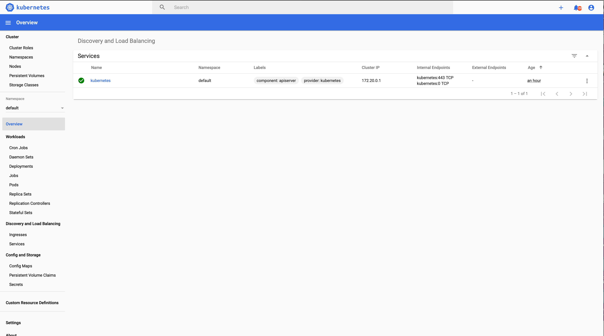
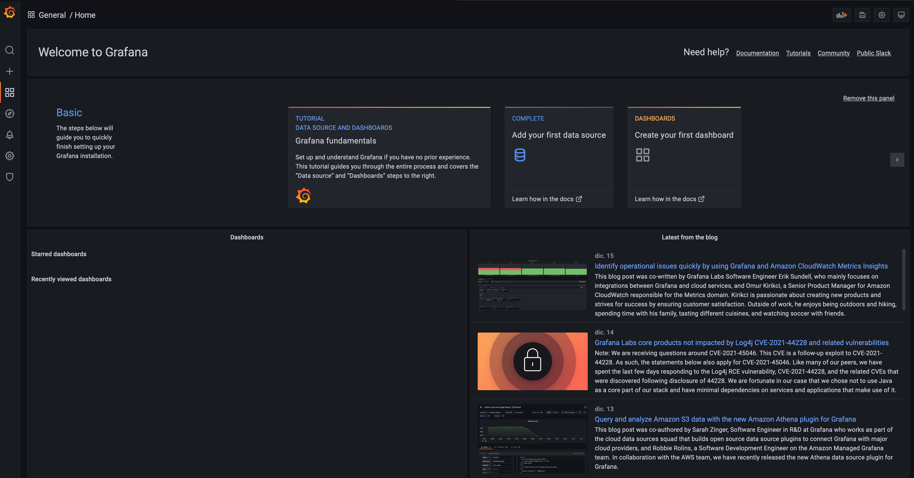
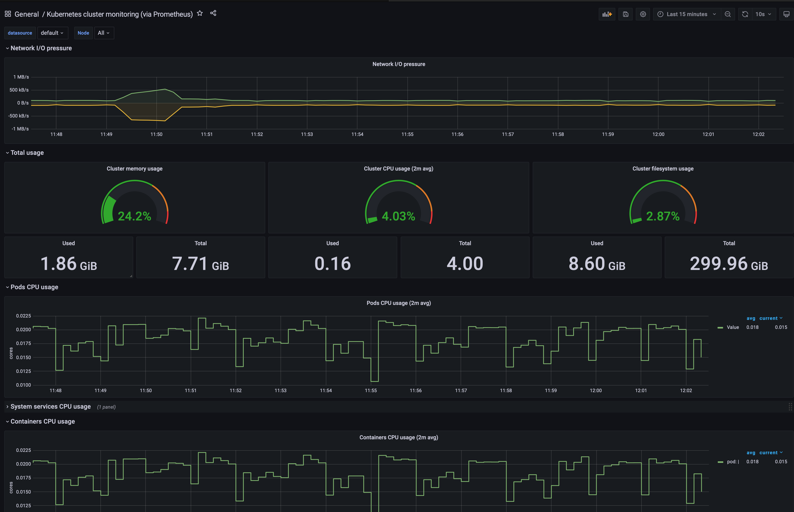
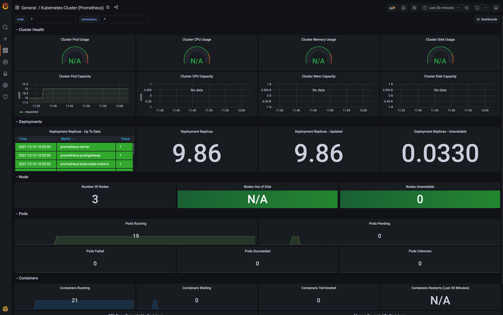
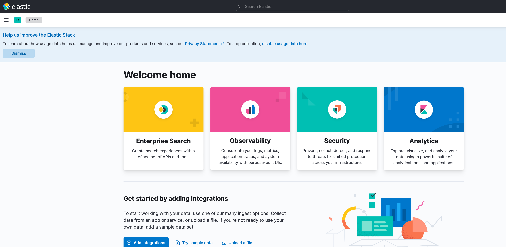

# k8s-monitoring-stack

Tabla de contenidos:
- [Prerequisitos](#id-pre)
- [Generación de cluster K8s en AWS EKS](#gen-k8s)
- [Prometheus](#prometheus)
- [Grafana](#grafana)
- [Elastic](#elastic)
- [Kibana](#kibana)
- [Filebeat](#filebeat)
- [Metricbeat](#metricbeat)

<div id='id-pre'/>

## Prerequisitos y herramientas a tener instaladas en local con últimas versiones disponibles.
- aws cli con cuenta configurada de AWS Access Key ID y AWS Secret Access Key
- terraform
- kubectl
- helm

<div id='gen-k8s'/>

## Generación de cluster K8s en AWS EKS

Se parte de la plantilla de ejemplo de Terraform, disponible en el siguiente enlace:
- https://learn.hashicorp.com/tutorials/terraform/eks

```
git clone https://github.com/hashicorp/learn-terraform-provision-eks-cluster
```

Se cogen los archivos del repositorio anterior necesarios para la creación del cluster EKS.

1) Creamos e inicializamos el entorno de Terraform. En la raíz de la descarga de este repositorio:

```
terraform init
```

2) Editamos el fichero de eks-cluster.tf para ajustar los worker_groups como deseemos:

```
worker_groups = [
  {
    name                          = "worker-group-1"
    instance_type                 = "t2.small"
    additional_userdata           = "echo foo bar"
    asg_desired_capacity          = 2
    additional_security_group_ids = [aws_security_group.worker_group_mgmt_one.id]
  },
  {
    name                          = "worker-group-2"
    instance_type                 = "t2.medium"
    additional_userdata           = "echo foo bar"
    additional_security_group_ids = [aws_security_group.worker_group_mgmt_two.id]
    asg_desired_capacity          = 1
  },
]
```

3) Previsualizamos el cluster de EKS a generar:

```
terraform plan
```

4) Lanzamos la creación del cluster de EKS (tarda como 10 minutos):

```
terraform apply
```

5) Configuramos el kubectl

```
aws eks --region $(terraform output -raw region) update-kubeconfig --name $(terraform output -raw cluster_name)
```

Verificamos la correcta vinculación del nuevo cluster:
```
kubectl config get-contexts
```

Revisamos nodos y pods en ejecución:

```
kubectl get nodes -o wide

kubectl get pods -n kube-system

kubectl get pods --all-namespaces
```

6) Despliegue de Metric Server
```
wget -O v0.3.6.tar.gz https://codeload.github.com/kubernetes-sigs/metrics-server/tar.gz/v0.3.6 && tar -xzf v0.3.6.tar.gz

kubectl apply -f metrics-server-0.3.6/deploy/1.8+/

rm -rf metrics-server-0.3.6 v0.3.6.tar.gz
```

Verificamos que se ha desplegado de forma correcta:
```
$ kubectl get deployment metrics-server -n kube-system
NAME             READY   UP-TO-DATE   AVAILABLE   AGE
metrics-server   1/1     1            1           87s
```

7) Despliegue y uso de Kubernetes Dashboard
```
kubectl apply -f https://raw.githubusercontent.com/kubernetes/dashboard/v2.0.0-beta8/aio/deploy/recommended.yaml
```

Ejecutamos un proxy para trasladar a local la comunicación con el Dashboard:
```
kubectl proxy
```

Abrimos el siguiente enlace en el navegador [http://127.0.0.1:8001/api/v1/namespaces/kubernetes-dashboard/services/https:kubernetes-dashboard:/proxy]

Creamos un Role Binding para permitir al cluster-admin acceder al cuadro de mando:
```
kubectl apply -f https://raw.githubusercontent.com/hashicorp/learn-terraform-provision-eks-cluster/master/kubernetes-dashboard-admin.rbac.yaml
```

Extraemos el token para acceder al Kubernetes Dashboard:
```
kubectl -n kube-system describe secret $(kubectl -n kube-system get secret | grep service-controller-token | awk '{print $1}')
```

Visualización de Kubernetes Dashboard:



<div id='prometheus'/>

## Prometheus

La documentación de este README ha sido sacada del siguiente enlace: https://www.eksworkshop.com/intermediate/240_monitoring/

1) Añadimos los repositorios de Helm de Grafana y de Prometheus:
```
# add prometheus Helm repo
helm repo add prometheus-community https://prometheus-community.github.io/helm-charts

# add grafana Helm repo
helm repo add grafana https://grafana.github.io/helm-charts
```

2) Instalación de Prometheus:
```
kubectl create namespace prometheus

helm install prometheus prometheus-community/prometheus \
    --namespace prometheus \
    --set alertmanager.persistentVolume.storageClass="gp2" \
    --set server.persistentVolume.storageClass="gp2"
```

La salida de los comandos anteriores nos indican cómo poder acceder a los servicios Prometheus server, AlertManager, PushGateway:
```
namespace/prometheus created
WARNING: "kubernetes-charts.storage.googleapis.com" is deprecated for "stable" and will be deleted Nov. 13, 2020.
WARNING: You should switch to "https://charts.helm.sh/stable" via:
WARNING: helm repo add "stable" "https://charts.helm.sh/stable" --force-update
NAME: prometheus
LAST DEPLOYED: Thu Dec 16 11:27:19 2021
NAMESPACE: prometheus
STATUS: deployed
REVISION: 1
TEST SUITE: None
NOTES:
The Prometheus server can be accessed via port 80 on the following DNS name from within your cluster:
prometheus-server.prometheus.svc.cluster.local


Get the Prometheus server URL by running these commands in the same shell:
  export POD_NAME=$(kubectl get pods --namespace prometheus -l "app=prometheus,component=server" -o jsonpath="{.items[0].metadata.name}")
  kubectl --namespace prometheus port-forward $POD_NAME 9090


The Prometheus alertmanager can be accessed via port 80 on the following DNS name from within your cluster:
prometheus-alertmanager.prometheus.svc.cluster.local


Get the Alertmanager URL by running these commands in the same shell:
  export POD_NAME=$(kubectl get pods --namespace prometheus -l "app=prometheus,component=alertmanager" -o jsonpath="{.items[0].metadata.name}")
  kubectl --namespace prometheus port-forward $POD_NAME 9093
#################################################################################
######   WARNING: Pod Security Policy has been moved to a global property.  #####
######            use .Values.podSecurityPolicy.enabled with pod-based      #####
######            annotations                                               #####
######            (e.g. .Values.nodeExporter.podSecurityPolicy.annotations) #####
#################################################################################


The Prometheus PushGateway can be accessed via port 9091 on the following DNS name from within your cluster:
prometheus-pushgateway.prometheus.svc.cluster.local


Get the PushGateway URL by running these commands in the same shell:
  export POD_NAME=$(kubectl get pods --namespace prometheus -l "app=prometheus,component=pushgateway" -o jsonpath="{.items[0].metadata.name}")
  kubectl --namespace prometheus port-forward $POD_NAME 9091

For more information on running Prometheus, visit:
https://prometheus.io/
```

Verificación del correcto funcionamiento de Prometheus desplegado en el cluster:
```
kubectl get all -n prometheus
NAME                                                 READY   STATUS    RESTARTS   AGE
pod/prometheus-alertmanager-67b88b45b4-fn6tl         2/2     Running   0          4m34s
pod/prometheus-kube-state-metrics-68b6c8b5c5-xt652   1/1     Running   0          4m34s
pod/prometheus-node-exporter-9bjkb                   1/1     Running   0          4m34s
pod/prometheus-node-exporter-nn6jv                   1/1     Running   0          4m34s
pod/prometheus-node-exporter-zhq5m                   1/1     Running   0          4m34s
pod/prometheus-pushgateway-8655bf87b9-dvj67          1/1     Running   0          4m34s
pod/prometheus-server-bf5fffb66-6z9k2                2/2     Running   0          4m34s

NAME                                    TYPE        CLUSTER-IP       EXTERNAL-IP   PORT(S)    AGE
service/prometheus-alertmanager         ClusterIP   172.20.114.76    <none>        80/TCP     4m34s
service/prometheus-kube-state-metrics   ClusterIP   172.20.50.0      <none>        8080/TCP   4m34s
service/prometheus-node-exporter        ClusterIP   None             <none>        9100/TCP   4m34s
service/prometheus-pushgateway          ClusterIP   172.20.126.173   <none>        9091/TCP   4m34s
service/prometheus-server               ClusterIP   172.20.176.206   <none>        80/TCP     4m34s

NAME                                      DESIRED   CURRENT   READY   UP-TO-DATE   AVAILABLE   NODE SELECTOR   AGE
daemonset.apps/prometheus-node-exporter   3         3         3       3            3           <none>          4m34s

NAME                                            READY   UP-TO-DATE   AVAILABLE   AGE
deployment.apps/prometheus-alertmanager         1/1     1            1           4m34s
deployment.apps/prometheus-kube-state-metrics   1/1     1            1           4m34s
deployment.apps/prometheus-pushgateway          1/1     1            1           4m34s
deployment.apps/prometheus-server               1/1     1            1           4m34s

NAME                                                       DESIRED   CURRENT   READY   AGE
replicaset.apps/prometheus-alertmanager-67b88b45b4         1         1         1       4m34s
replicaset.apps/prometheus-kube-state-metrics-68b6c8b5c5   1         1         1       4m34s
replicaset.apps/prometheus-pushgateway-8655bf87b9          1         1         1       4m34s
replicaset.apps/prometheus-server-bf5fffb66                1         1         1       4m34s
```

3) Borrado del helm de Prometheus:
```
helm uninstall prometheus --namespace prometheus
kubectl delete ns prometheus
```

<div id='grafana'/>

## Grafana

1) Creamos un fichero de configuración de grafana que será usado por la plantilla de helm:
```
$ cat grafana.yaml
datasources:
  datasources.yaml:
    apiVersion: 1
    datasources:
    - name: Prometheus
      type: prometheus
      url: http://prometheus-server.prometheus.svc.cluster.local
      access: proxy
      isDefault: true
```

2) Realizamos la instalación del Helm:
```
kubectl create namespace grafana

helm install grafana grafana/grafana \
    --namespace grafana \
    --set persistence.storageClassName="gp2" \
    --set persistence.enabled=true \
    --set adminPassword='EKS!sAWSome#Evolutio' \
    --values grafana.yaml \
    --set service.type=LoadBalancer
```

La salida de la instalación nos indica cómo poder acceder a la interfaz de Grafana:
```
namespace/grafana created
WARNING: "kubernetes-charts.storage.googleapis.com" is deprecated for "stable" and will be deleted Nov. 13, 2020.
WARNING: You should switch to "https://charts.helm.sh/stable" via:
WARNING: helm repo add "stable" "https://charts.helm.sh/stable" --force-update
W1216 11:36:34.152570   34462 warnings.go:70] policy/v1beta1 PodSecurityPolicy is deprecated in v1.21+, unavailable in v1.25+
W1216 11:36:34.278073   34462 warnings.go:70] policy/v1beta1 PodSecurityPolicy is deprecated in v1.21+, unavailable in v1.25+
W1216 11:36:36.606856   34462 warnings.go:70] policy/v1beta1 PodSecurityPolicy is deprecated in v1.21+, unavailable in v1.25+
W1216 11:36:36.606895   34462 warnings.go:70] policy/v1beta1 PodSecurityPolicy is deprecated in v1.21+, unavailable in v1.25+
NAME: grafana
LAST DEPLOYED: Thu Dec 16 11:36:31 2021
NAMESPACE: grafana
STATUS: deployed
REVISION: 1
NOTES:
1. Get your 'admin' user password by running:

   kubectl get secret --namespace grafana grafana -o jsonpath="{.data.admin-password}" | base64 --decode ; echo

2. The Grafana server can be accessed via port 80 on the following DNS name from within your cluster:

   grafana.grafana.svc.cluster.local

   Get the Grafana URL to visit by running these commands in the same shell:
NOTE: It may take a few minutes for the LoadBalancer IP to be available.
        You can watch the status of by running 'kubectl get svc --namespace grafana -w grafana'
     export SERVICE_IP=$(kubectl get svc --namespace grafana grafana -o jsonpath='{.status.loadBalancer.ingress[0].ip}')
     http://$SERVICE_IP:80

3. Login with the password from step 1 and the username: admin
```


Así mismo, la verificación de que se han creado los componentes de forma adecuada es la siguiente:
```
kubectl get all -n grafana
NAME                           READY   STATUS    RESTARTS   AGE
pod/grafana-54669d564b-7s672   1/1     Running   0          3m30s

NAME              TYPE           CLUSTER-IP      EXTERNAL-IP                                                                  PORT(S)        AGE
service/grafana   LoadBalancer   172.20.163.24   a4a59fdcd2e39419d845d0688068c4e1-2126680764.eu-central-1.elb.amazonaws.com   80:31483/TCP   3m30s

NAME                      READY   UP-TO-DATE   AVAILABLE   AGE
deployment.apps/grafana   1/1     1            1           3m31s

NAME                                 DESIRED   CURRENT   READY   AGE
replicaset.apps/grafana-54669d564b   1         1         1       3m31s
```

3) Acceso al interface web de grafana:

Obtenemos la ip del Elastic Load Balancer para acceder a Grafana:
```
export ELB=$(kubectl get svc -n grafana grafana -o jsonpath='{.status.loadBalancer.ingress[0].hostname}')
echo "http://$ELB"
```

Aunque se ha lanzado con la clave en el helm, si necesitamos acceder a la misma en los secrets:
```
kubectl get secret --namespace grafana grafana -o jsonpath="{.data.admin-password}" | base64 --decode ; echo
```


4) Creamos los cuadros de mando nativos para Cluster Monitoring de Kubernetes en Prometheus de Grafana:
- Click '+' button on left panel and select ‘Import’.
- Enter 3119 dashboard id under Grafana.com Dashboard.
- Click ‘Load’.
- Select ‘Prometheus’ as the endpoint under prometheus data sources drop down.
- Click ‘Import’.



5) Creamos los cuadros de mando nativos para Pod Monitoring de Kubernetes en Prometheus de Grafana:
- Click '+' button on left panel and select ‘Import’.
- Enter 6417 dashboard id under Grafana.com Dashboard.
- Click ‘Load’.
- Enter Kubernetes Pods Monitoring as the Dashboard name.
- Click change to set the Unique identifier (uid).
- Select ‘Prometheus’ as the endpoint under prometheus data sources drop down.s
- Click ‘Import’.



6) Borrado del helm de Grafana:
```
helm uninstall grafana --namespace grafana
kubectl delete ns grafana
```

<div id='elastic' />

## Elastic

La guía seguida oficial es: [https://www.elastic.co/guide/en/cloud-on-k8s/master/k8s-deploy-eck.html]

1. Generamos la definición de recursos oficial de Elastic:
```
kubectl create -f https://download.elastic.co/downloads/eck/1.9.0/crds.yaml
kubectl apply -f https://download.elastic.co/downloads/eck/1.9.0/operator.yaml
```

Para verificar el correcto lanzamiento del Elastic Operator podemos ver sus logs:
```
kubectl -n elastic-system logs -f statefulset.apps/elastic-operator
```

2. Lanzamos el cluster de ElasticSearch en K8s:

```
cat <<EOF | kubectl apply -f -
apiVersion: elasticsearch.k8s.elastic.co/v1
kind: Elasticsearch
metadata:
  name: quickstart
spec:
  version: 7.16.1
  nodeSets:
  - name: default
    count: 1
    config:
      node.store.allow_mmap: false
EOF
```
Verificar el funcionamiento:

```
$ kubectl get elasticsearch
NAME         HEALTH    NODES   VERSION   PHASE             AGE
quickstart   unknown           7.16.1    ApplyingChanges   19s

$ kubectl get pods
NAME                      READY   STATUS    RESTARTS   AGE
quickstart-es-default-0   1/1     Running   0          3m38s
```

3) Acceso desde local al cluster de elastic creado

- Obtener dirección del servicio de Elastic desplegado
```
$ kubectl get service quickstart-es-http
NAME                 TYPE        CLUSTER-IP      EXTERNAL-IP   PORT(S)    AGE
quickstart-es-http   ClusterIP   172.20.30.162   <none>        9200/TCP   4m18s
```
- Conseguir las crendenciales de acceso. Usuario "elastic"
```
export PASSWORD=$(kubectl get secret quickstart-es-elastic-user -o go-template='{{.data.elastic | base64decode}}')
```

- Redireccionar el puerto del servicio a local:
```
kubectl port-forward service/quickstart-es-http 9200
```

- Lanzar peticion:
```
$ curl -u "elastic:$PASSWORD" -k "https://localhost:9200"
{
  "name" : "quickstart-es-default-0",
  "cluster_name" : "quickstart",
  "cluster_uuid" : "8rwriqpQSkq1qrHTGHamwQ",
  "version" : {
    "number" : "7.16.1",
    "build_flavor" : "default",
    "build_type" : "docker",
    "build_hash" : "5b38441b16b1ebb16a27c107a4c3865776e20c53",
    "build_date" : "2021-12-11T00:29:38.865893768Z",
    "build_snapshot" : false,
    "lucene_version" : "8.10.1",
    "minimum_wire_compatibility_version" : "6.8.0",
    "minimum_index_compatibility_version" : "6.0.0-beta1"
  },
  "tagline" : "You Know, for Search"
}
```

<div id='kibana' />

## Kibana

1. Desplegamos la instancia de Kibana:
```
cat <<EOF | kubectl apply -f -
apiVersion: kibana.k8s.elastic.co/v1
kind: Kibana
metadata:
  name: quickstart
spec:
  version: 7.16.1
  count: 1
  elasticsearchRef:
    name: quickstart
EOF
```

2. Acceso a Kibana:
```
$ kubectl get service quickstart-kb-http
NAME                 TYPE        CLUSTER-IP     EXTERNAL-IP   PORT(S)    AGE
quickstart-kb-http   ClusterIP   172.20.50.77   <none>        5601/TCP   5m49s

$ kubectl port-forward service/quickstart-kb-http 5601
Forwarding from 127.0.0.1:5601 -> 5601
Forwarding from [::1]:5601 -> 5601
```

Obtener la clave del usuario de kibana 'elastic' (la misma que de elastic anterior):
```
kubectl get secret quickstart-es-elastic-user -o=jsonpath='{.data.elastic}' | base64 --decode; echo
```



<div id='filebeat' />

## Filebeat

<div id='metricbeat' />

## Metricbeat
